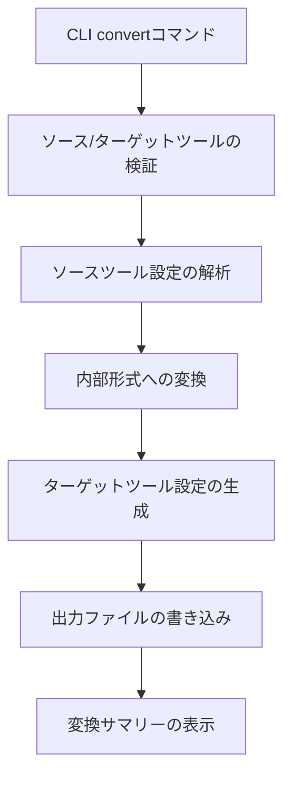

# 設計ドキュメント

## 概要

直接ツール変換機能は、rulesyncに新しい`convert`コマンドを追加し、中間の`.rulesync/*.md`形式を必要とせずに、AIツール設定を一つの形式から別の形式に直接変換できるようにします。この機能は、既存のパーサーとジェネレーターのインフラストラクチャを活用しながら、新しい変換オーケストレーション層を導入します。

## アーキテクチャ

### 高レベルフロー



### コンポーネント統合

変換機能は既存のrulesyncコンポーネントと統合されます：

- **パーサー**: 既存のツール固有パーサー（`src/parsers/`）を再利用
- **ジェネレーター**: 既存のツール固有ジェネレーター（`src/generators/rules/`）を再利用
- **型**: 既存の`ParsedRule`と`ToolTarget`型を活用
- **CLI**: `src/cli/commands/`の既存コマンドと並んで新しいコマンドを追加

## コンポーネントとインターフェース

### CLIコマンドインターフェース

```typescript
// 新しいコマンド: src/cli/commands/convert.ts
interface ConvertOptions {
  from: ToolTarget;
  to: string; // カンマ区切りのターゲットツールリスト
  baseDir?: string;
  verbose?: boolean;
}

export async function convertCommand(options: ConvertOptions): Promise<void>
```

### コア変換エンジン

```typescript
// 新しいコアモジュール: src/core/converter.ts
interface ConversionRequest {
  sourceTools: ToolTarget;
  targetTools: ToolTarget[];
  baseDir: string;
}

interface ConversionResult {
  sourceRules: ParsedRule[];
  outputs: GeneratedOutput[];
  errors: string[];
  warnings: string[];
}

export async function convertToolConfigurations(
  request: ConversionRequest
): Promise<ConversionResult>
```

### パーサー統合

変換エンジンは統一されたインターフェースを通じて既存のパーサーを使用します：

```typescript
// 拡張されたパーサーインターフェース
type ToolParser = (baseDir: string) => Promise<{
  rules: ParsedRule[];
  errors: string[];
  ignorePatterns?: string[];
  mcpServers?: Record<string, RulesyncMcpServer>;
}>;

const TOOL_PARSERS: Record<ToolTarget, ToolParser> = {
  cursor: parseCursorConfiguration,
  copilot: parseCopilotConfiguration,
  cline: parseClineConfiguration,
  // ... その他のパーサー
};
```

### ジェネレーター統合

変換エンジンは現在のインターフェースを通じて既存のジェネレーターを使用します：

```typescript
// src/core/generator.tsの既存ジェネレーターインターフェースを再利用
export async function generateConfigurations(
  rules: ParsedRule[],
  config: Config,
  targetTools?: ToolTarget[],
  baseDir?: string,
): Promise<GeneratedOutput[]>
```

## データモデル

### 変換設定

```typescript
interface ConversionConfig {
  // 変換用の最小限の設定 - 完全なrulesync設定は不要
  defaultTargets: ToolTarget[];
  baseDir: string;
}
```

### ルール変換

変換プロセスは以下の段階を通じてルールを変換します：

1. **ソース形式** → **ParsedRule[]**（既存パーサー経由）
2. **ParsedRule[]** → **ParsedRule[]**（変換/正規化）
3. **ParsedRule[]** → **ターゲット形式**（既存ジェネレーター経由）

### 変換ルール

```typescript
interface RuleTransformation {
  // 変換用のターゲット仕様を正規化
  normalizeTargets(rule: ParsedRule, targetTool: ToolTarget): ParsedRule;
  
  // ツール固有のメタデータを処理
  transformMetadata(rule: ParsedRule, sourceTool: ToolTarget, targetTool: ToolTarget): ParsedRule;
  
  // 互換性を検証
  validateCompatibility(rule: ParsedRule, targetTool: ToolTarget): ValidationResult;
}
```

## エラーハンドリング

### エラーカテゴリ

1. **検証エラー**: 無効なソース/ターゲットツール、設定の欠如
2. **解析エラー**: 不正なソース設定ファイル
3. **生成エラー**: ターゲット設定の生成失敗
4. **ファイルシステムエラー**: 権限問題、ディレクトリの欠如

### エラー報告

```typescript
interface ConversionError {
  type: 'validation' | 'parse' | 'generation' | 'filesystem';
  tool?: ToolTarget;
  file?: string;
  message: string;
  suggestion?: string;
}
```

### グレースフル劣化

- 一つのツールが失敗しても他のターゲットツールの処理を継続
- 詳細なエラーコンテキストと回復提案を提供
- 致命的エラー（処理停止）と警告（通知付きで継続）を区別

## テスト戦略

### ユニットテスト

1. **CLIコマンドテスト**: 引数解析、検証、エラーハンドリング
2. **変換エンジンテスト**: コア変換ロジック、エラーシナリオ
3. **統合テスト**: エンドツーエンド変換フロー
4. **パーサー統合テスト**: 既存パーサーが変換コンテキストで正しく動作することを確認

### テストデータ構造

```
src/core/__tests__/
├── fixtures/
│   ├── cursor/
│   │   ├── .cursorrules
│   │   └── .cursor/rules/*.mdc
│   ├── copilot/
│   │   └── .github/copilot-instructions.md
│   └── expected-outputs/
│       ├── cursor-to-copilot/
│       └── copilot-to-cursor/
├── converter.test.ts
└── convert-command.test.ts
```

### テストシナリオ

1. **単一ツール変換**: `--from cursor --to copilot`
2. **マルチツール変換**: `--from cursor --to copilot,claudecode`
3. **エラーハンドリング**: 無効なツール、ソースファイルの欠如、権限エラー
4. **エッジケース**: 空の設定、複雑なルール構造
5. **互換性**: 異なるツール間の機能マッピング

## 実装フェーズ

### フェーズ1: コアインフラストラクチャ
- CLIコマンド構造の追加
- 基本変換エンジンの実装
- ツール検証とエラーハンドリングの追加

### フェーズ2: パーサー統合
- 既存パーサーを変換フローに統合
- ルール変換ロジックの追加
- 互換性検証の実装

### フェーズ3: ジェネレーター統合
- 既存ジェネレーターへの接続
- 出力ファイル管理の追加
- 変換サマリー報告の実装

### フェーズ4: テストと仕上げ
- 包括的なテストカバレッジ
- エラーメッセージの改善
- ドキュメントと例