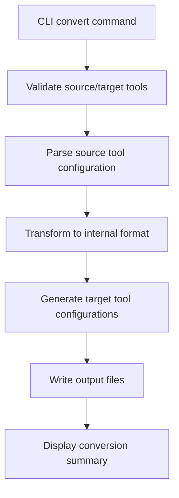

# Design Document

## Overview

The direct tool conversion feature adds a new `convert` command to rulesync that enables direct transformation of AI tool configurations from one format to another without requiring the intermediate `.rulesync/*.md` format. This feature leverages the existing parser and generator infrastructure while introducing a new conversion orchestration layer.

## Architecture

### High-Level Flow



### Component Integration

The conversion feature integrates with existing rulesync components:

- **Parsers**: Reuse existing tool-specific parsers (`src/parsers/`)
- **Generators**: Reuse existing tool-specific generators (`src/generators/rules/`)
- **Types**: Leverage existing `ParsedRule` and `ToolTarget` types
- **CLI**: Add new command alongside existing commands in `src/cli/commands/`

## Components and Interfaces

### CLI Command Interface

```typescript
// New command: src/cli/commands/convert.ts
interface ConvertOptions {
  from: ToolTarget;
  to: string; // Comma-separated list of target tools
  baseDir?: string;
  verbose?: boolean;
}

export async function convertCommand(options: ConvertOptions): Promise<void>
```

### Core Conversion Engine

```typescript
// New core module: src/core/converter.ts
interface ConversionRequest {
  sourceTools: ToolTarget;
  targetTools: ToolTarget[];
  baseDir: string;
}

interface ConversionResult {
  sourceRules: ParsedRule[];
  outputs: GeneratedOutput[];
  errors: string[];
  warnings: string[];
}

export async function convertToolConfigurations(
  request: ConversionRequest
): Promise<ConversionResult>
```

### Parser Integration

The conversion engine will use existing parsers through a unified interface:

```typescript
// Enhanced parser interface
type ToolParser = (baseDir: string) => Promise<{
  rules: ParsedRule[];
  errors: string[];
  ignorePatterns?: string[];
  mcpServers?: Record<string, RulesyncMcpServer>;
}>;

const TOOL_PARSERS: Record<ToolTarget, ToolParser> = {
  cursor: parseCursorConfiguration,
  copilot: parseCopilotConfiguration,
  cline: parseClineConfiguration,
  // ... other parsers
};
```

### Generator Integration

The conversion engine will use existing generators through the current interface:

```typescript
// Reuse existing generator interface from src/core/generator.ts
export async function generateConfigurations(
  rules: ParsedRule[],
  config: Config,
  targetTools?: ToolTarget[],
  baseDir?: string,
): Promise<GeneratedOutput[]>
```

## Data Models

### Conversion Configuration

```typescript
interface ConversionConfig {
  // Minimal config for conversion - no need for full rulesync config
  defaultTargets: ToolTarget[];
  baseDir: string;
}
```

### Rule Transformation

The conversion process transforms rules through these stages:

1. **Source Format** → **ParsedRule[]** (via existing parsers)
2. **ParsedRule[]** → **ParsedRule[]** (transformation/normalization)
3. **ParsedRule[]** → **Target Format** (via existing generators)

### Transformation Rules

```typescript
interface RuleTransformation {
  // Normalize target specifications for conversion
  normalizeTargets(rule: ParsedRule, targetTool: ToolTarget): ParsedRule;
  
  // Handle tool-specific metadata
  transformMetadata(rule: ParsedRule, sourceTool: ToolTarget, targetTool: ToolTarget): ParsedRule;
  
  // Validate compatibility
  validateCompatibility(rule: ParsedRule, targetTool: ToolTarget): ValidationResult;
}
```

## Error Handling

### Error Categories

1. **Validation Errors**: Invalid source/target tools, missing configurations
2. **Parse Errors**: Malformed source configuration files
3. **Generation Errors**: Failed to generate target configurations
4. **File System Errors**: Permission issues, missing directories

### Error Reporting

```typescript
interface ConversionError {
  type: 'validation' | 'parse' | 'generation' | 'filesystem';
  tool?: ToolTarget;
  file?: string;
  message: string;
  suggestion?: string;
}
```

### Graceful Degradation

- Continue processing other target tools if one fails
- Provide detailed error context and recovery suggestions
- Distinguish between fatal errors (stop processing) and warnings (continue with notification)

## Testing Strategy

### Unit Tests

1. **CLI Command Tests**: Argument parsing, validation, error handling
2. **Conversion Engine Tests**: Core conversion logic, error scenarios
3. **Integration Tests**: End-to-end conversion flows
4. **Parser Integration Tests**: Ensure existing parsers work correctly in conversion context

### Test Data Structure

```
src/core/__tests__/
├── fixtures/
│   ├── cursor/
│   │   ├── .cursorrules
│   │   └── .cursor/rules/*.mdc
│   ├── copilot/
│   │   └── .github/copilot-instructions.md
│   └── expected-outputs/
│       ├── cursor-to-copilot/
│       └── copilot-to-cursor/
├── converter.test.ts
└── convert-command.test.ts
```

### Test Scenarios

1. **Single Tool Conversion**: `--from cursor --to copilot`
2. **Multi-Tool Conversion**: `--from cursor --to copilot,claudecode`
3. **Error Handling**: Invalid tools, missing source files, permission errors
4. **Edge Cases**: Empty configurations, complex rule structures
5. **Compatibility**: Feature mapping between different tools

## Implementation Phases

### Phase 1: Core Infrastructure
- Add CLI command structure
- Implement basic conversion engine
- Add tool validation and error handling

### Phase 2: Parser Integration
- Integrate existing parsers into conversion flow
- Add rule transformation logic
- Implement compatibility validation

### Phase 3: Generator Integration
- Connect to existing generators
- Add output file management
- Implement conversion summary reporting

### Phase 4: Testing & Polish
- Comprehensive test coverage
- Error message improvements
- Documentation and examples